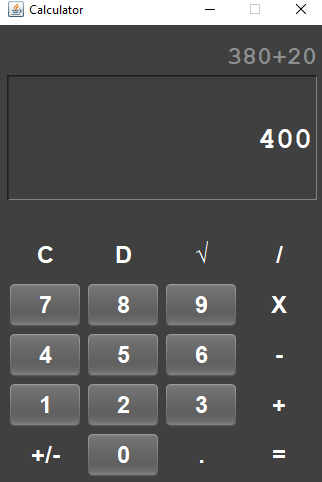

  <a href="https://github.com/MALEK-FRAIJ/Java-Calculator.git">
  
# Java-Calculator

# Logo 

- [Introduction](#introduction)
- [Java-Calculator Snapshot](#java-calculator-snapshot)
- [Java-Calculator Snapshot UI Maniger](#java-calculator-snapshot-ui-maniger)
- [Java-Calculator](#java-calculator)

## Introduction

This is a simple GUI calculator app which will perform basic arithmetic operations like addition, subtraction, multiplication, division etc. project is an application of what I learned in Java.

 

## Java-Calculator Snapshot 

### Can you add another mode

### another mode 

## Java-Calculator Snapshot UI Maniger

## Java-Calculator

This is a simple calculator based on a graphical user interface, where many modes can be added and control the size and design of the buttons, it came as a practical application of what I learned in Java and the concepts of object-oriented programming where the swing library was used and some Layuot UI Manger was used.

